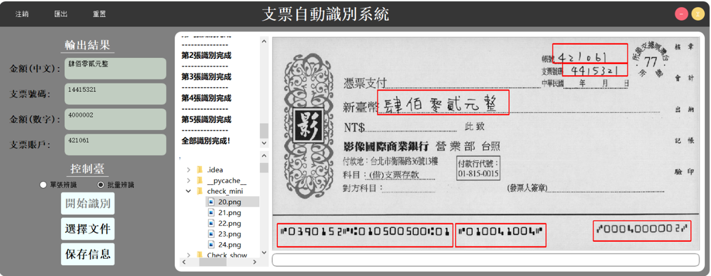

# 基於 CTPN 和 CRNN 模型的台灣支票辨識系统

## 一、支票識別系統
### 1. 系統程式構成
- CRNN 資料夾：包含 CRNN 架構模型。
- CRNN_model 資料夾：包含已訓練的針對漢字日期以及數字識別模型。
- CTPN 資料夾：包含 CTPN 架構模型。
- CTPN_model 資料夾：包含已訓練的針對目標檢測模型。
- icon 資料夾：系統内的圖標和圖案。
- MICR 資料夾：包含 MICR 架構模型。
- MICR_model：包含 MICR 模型。
- SQL 資料夾：包含資料庫處理相關 Python 檔案以及資料庫文件。
- Check_demo：包含可以用於快速測試系統功能的支票圖片。
- RecognitionLoad.py：登錄界面。
- RecognitionMain.py：識別主界面。
- RecognitionModel.py：支票識別模型。
- RecognitionRegister.py：注冊界面。
- requirements.txt：環境文件。
- exe->check->RecognitionLoad.exe: 可執行檔
- RecognitionLoad.spec: pyinstaller 生成 exe(小黑 pyinstaller RecognitionLoad.spec)

### 2. 系統使用流程
安裝完系統後，點擊 RecognitionLoad.py 進入登錄界面。輸入郵箱、密碼以及可以進入本系統。

第一次使用的用戶可以點擊注冊按鈕進入注冊介面(RecognitionRegister.py)。通過自己的郵箱驗證碼進行綁定，所有用戶資料都將會保存在資料庫中(SQL 資料夾)。

進入本系統，是整個支票識別的主介面(RecognitionMain.py)，左邊部分是輸出結果和控制台部分。中間由資訊交互視窗以及可視化路徑組成。最右邊是支票圖像展示區域以及相應的圖像路徑。

本系統分爲單張識別和批量識別模式，點擊開始識別將調用 RecognitionModel.py。點擊單張識別，通過可視化路徑選擇所要辨識的支票圖片，再點擊開始識別，系統會對支票自動進行辨識，並將文本結果輸出到左邊顯示框，並且在支票圖像展示區域也會框選識別目標。使用者可以點擊保存資訊，將這次的識別結果先保存於後台。

當遇到大量支票需要辨識時，可以選擇批量識別模式，選擇所要辨識的支票資料夾，所有支票檔名會先顯示在資訊交互視窗。再點擊開始識別，系統開始自動辨識，每張支票大概只消耗 2-3 秒的時間。等待辨識結束，可以點擊保存資訊將結果存於後台。

當所有辨識結果已經保存，可以點擊上方匯出按鈕，系統會自動將已保存的支票資訊生成一份 Excel 檔案，以提供給用戶進行後期使用。

